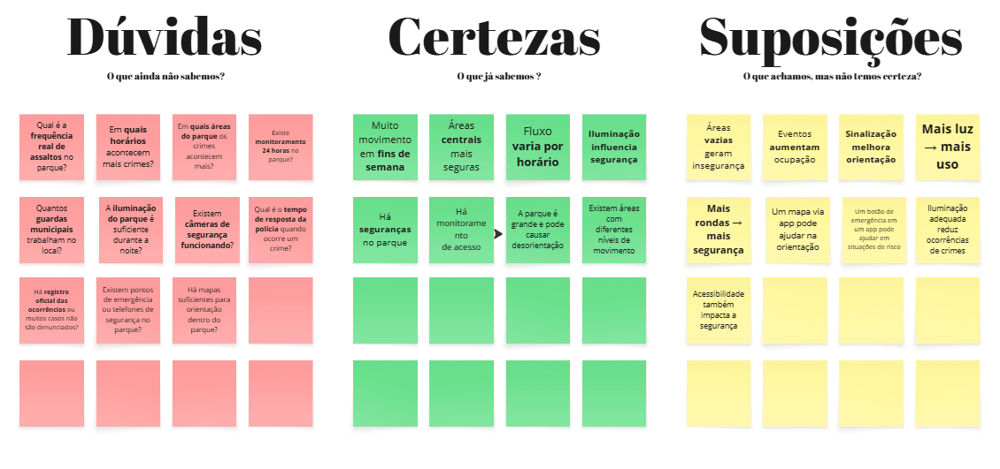
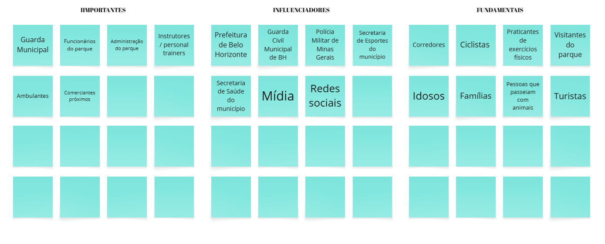
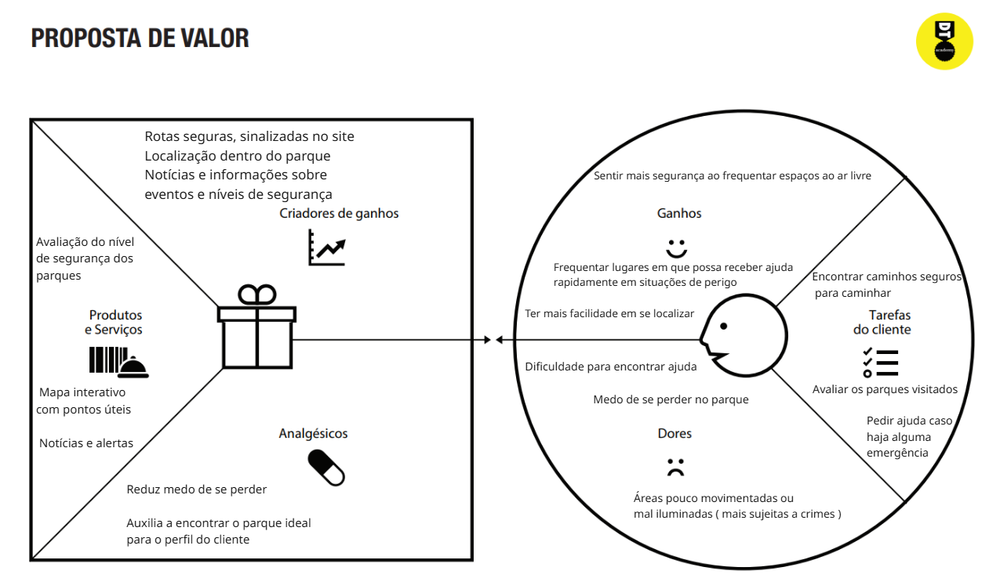

# INTRODUÇÃO
Nosso objetivo é desenvolver uma aplicação web que permita aos usuários pesquisar parques, realizar avaliações, verificar informações e rotas mais seguras dentro desses espaços.

# Projeto: GREEN GUARD

## Repositório GitHub:
https://github.com/ICEI-PUC-Minas-PMGES-TI/pmg-es-2026-1-ti1-0438100-greenguard.git

## Alunos integrantes da equipe:

* Caio Martins Caldeira - Líder 
* Kaique Rodrigues do Vale
* Gabriel Rodrigues Lima
* Crystian Marcondes Oliveira Nascimento
* Guilherme Enzo Almeida Ferreira
* Yandi Orlando Santos Rivero
* Pedro Miguel Souza Dias

## Professores responsáveis

* Diego Augusto de Faria Barros
* Henrique Almeida Louzada
* Lucca Soares de Paiva Lacerda

# Contexto do projeto
## Problema:
Atualmente, é difícil encontrar informações organizadas sobre parques em um único lugar. Isso acaba dificultando a escolha do local para se realizar atividades e o planejamento delas. Além disso, a falta de dados atualizados sobre segurança, iluminação e ocorrências criminais nos parques de BH contribui para a sensação de insegurança de quem frequenta esses ambientes a fim de praticar atividades ao ar livre. Em Belo Horizonte, por exemplo, a percepção de segurança no período noturno é considerada baixa, e existem registros de furtos e vandalismo em parques públicos.

## Objetivo do projeto:
O objetivo é desenvolver uma aplicação web que facilite a busca e visualização de informações sobre os parques de BH, permitindo que o usuário encontre locais próximos dele, visualize dados relevantes como mapas dos parques, endereços, pontos de apoio e consulte avaliações de outros usuários feitas pelo site. Dessa forma, os praticantes de atividades ao ar livre poderão ter uma noção melhor do ambiente que pretendem visitar antes de visitá-lo, auxiliando na segurança deles.

## Justificativa:
A falta de acesso prático a mapeamento e informações claras sobre os parques pode causar insegurança nas pessoas que realizam atividades ao ar livre, principalmente em Belo Horizonte, que, como citado anteriormente, possui uma baixa percepção de segurança. Estudos mostram que fatores como iluminação, infraestrutura e histórico de ocorrências influenciam diretamente nessa percepção. Nesse contexto, o projeto se propõe a centralizar essas informações no contexto dos parques da cidade e torná-las mais acessíveis às pessoas que desejam se sentir mais seguras.

## Público-alvo:
### Importantes:
* Guarda Municipal 
* Funcionários do parque 
* Administração do parque 
* Instrutores e ou personal trainers 
* Ambulantes 
* Comerciantes próximos

### Influenciadores:
* Prefeitura de Belo Horizonte
* Guarda Civil Municipal de BH
* Polícia Militar de Minas Gerais
* Secretaria de Esportes do município 
* Secretaria de Saúde do município 
* Mídia 
* Redes Sociais.

### Fundamentais:
* Corredores; 
* Ciclistas; 
* Praticantes de exercícios físicos; 
* Visitantes do parque; 
* Idosos; 
* Famílias; 
* Pessoas que passeiam com animais; 
* Turistas.

# Processo de Product Discovery:
## Matriz CSD:

  

## Mapa de stakeholders:

  

## Pesquisa e entendimento do problema:
Em Belo Horizonte, o índice de criminalidade é considerado relativamente alto (59,42), enquanto o nível de segurança é mais baixo (40,58). Além disso, a sensação de segurança ao andar sozinho à noite é de apenas 26 em uma escala de 0 a 100, indicando maior insegurança nesse período (Numbeo, 2026).

Estudos sobre espaços urbanos mostram que fatores como iluminação, presença de pessoas e infraestrutura influenciam diretamente na percepção de segurança. Locais com pouca iluminação ou baixa movimentação tendem a aumentar a sensação de insegurança, mesmo quando não há informações claras sobre ocorrências recentes.

Dessa forma, o problema não está apenas na existência de crimes, mas na falta de informações acessíveis que ajudem o usuário a entender melhor as condições de segurança dos parques antes de utilizá-los.

## Personas:

**Persona 1: Dona Lúcia**  
**Idade**: 67 anos  
**Hobby**: Caminhadas ao ar livre em Parques
**Trabalho**: Aposentada

**Personalidade**: Tranquila e sociável, porém cuidadosa

**Sonhos**: Se manter saudável e ativa sem preocupações.

**Objetos e Lugares**: Ela utiliza o celular, aplicativos como Google Maps para se orientar durante suas caminhadas no parque e grupos de Whatsapp para se informar de eventos ao ar Livre.  

**Objetivo Chave**: Seu principal objetivo é se sentir segura ao caminhar sozinha, conseguir se localizar facilmente dentro do parque e se informar sobre eventos de atividades físicas para idosos.

**Como devemos tratá-la**: Devemos tratá-la com simplicidade e clareza, oferecendo uma interface simples e fácil de navegar por, um mapa simples do parque que ela irá visitar, informações sobre possíveis eventos e alertas.
O comportamento que deixaria ela feliz seria o site funcionando rapidamente, mostrando rotas seguras de caminhada e permitindo que ela encontre as informações e novidades que precisa.

**Nunca devemos**: Nunca devemos complicar a interface ou usar linguagem difícil e esconder funções importantes (mapa, funções de ajuda). Ela não suporta e fica furiosa com apps lentos  ou confusos.

**Persona 2: Lucas Almeida**  
**Idade**: 8 anos  
**Hobby**: Brincar ao ar livre com sua família, andar de bicicleta, jogar bola e usar o celular para jogos
**Trabalho**: Estudante

**Personalidade**: É ativo, curioso e gosta de explorar o ambiente. Depende dos pais para se sentir seguro e não percebe riscos com facilidade

**Sonhos**: Poder brincar livremente em diferentes parques. Se divertir sem preocupação e ter momentos felizes com sua família.

**Objetos e Lugares**: Frequenta o Parque Municipal Américo Renné Giannetti com a família. Brincar em meios às árvores, anda de bicicleta pelas trilhas e joga futebol. Vai ao parque principalmente nos fins de semana.

**Objetivo Chave**: Se divertir e brincar. Explorar o ambiente sem medo. Estar próximo dos pais ou responsáveis. Conhecer novos parques.

**Como devemos tratá-la**: Transmitir sensação de segurança a ele e seus responsáveis por meio de informações claras sobre parques adequados para crianças, rotas seguras e ambientes bem iluminados.

**Nunca devemos**: Deixar os responsáveis desinformados sobre áreas mal iluminadas, sem vigilância, áreas de risco ou parques que podem não ser o ambiente ideal para seu filho. 

# Processo de Product Design:
## Histórias de usuários:
**Dona Lúcia**:
Eu como idosa que caminha sozinha no parque, quero visualizar minha localização em um mapa simples no celular, para conseguir me orientar facilmente e não me perder.

**Mãe da Criança Lucas Almeida**:
Eu como Mãe de uma criança quero levar meu filho em ambientes seguros e em que eu possa monitorá-lo com facilidade e receber apoio se necessário. 

## Proposta de Valor:

  

## Projeto de Interface:
### Wireframe:
 https://www.figma.com/design/CMkz5jHOl854m2UNuIhGdO/G4---Espa%C3%A7os-Seguros-para-Atividades-ao-Ar-Livre?node-id=0-1&t=voNOdiNS5YjjDp4r-1
### Fluxo de usuário com design das páginas finalizado e Protótipo interativo:
https://www.figma.com/design/CMkz5jHOl854m2UNuIhGdO/G4---Espa%C3%A7os-Seguros-para-Atividades-ao-Ar-Livre?node-id=53-2&t=Udf0tlWoGRWP1EuX-1 

# Metodologia:
## Ferramentas:
**Editor de código**: Visual Studio Code. 

Escolhido por ser leve, gratuito e ter suporte a diversas extensões que facilitam o desenvolvimento.

**Linguagens**: HTML, CSS e JavaScript. 

Escolhidas por serem a base do desenvolvimento web, permitindo criar a estrutura, o estilo e a interatividade da aplicação.

**Comunição**: WhatsApp. 

Usado pela praticidade e agilidade na comunicação entre os membros do grupo no dia a dia.

**Organização e planejamento**: Miro e WhatsApp.

O Miro foi escolhido por facilitar a criação de quadros, ajudando na organização de ideias e colaboração da equipe entre si.

**Prototipação**: Figma.

Utilizado por permitir a criação de wireframes/protótipos visuais de forma colaborativa, o que facilitará a validação das ideias entre os membros do grupo antes da implementação.

**Versionamento**: GitHub.

Usado para controle de versões do projeto, permitindo armazenar o código, acompanhar mudanças e trabalhar em equipe de forma organizada.

## Organização da equipe e divisão de papéis

A equipe se organizou usando ideias do Scrum, trabalhando de forma colaborativa e dividindo o projeto em pequenas etapas. Isso ajudou a desenvolver essa parte inicial do projeto aos poucos, permitindo ajustes conforme necessário ao longo do processo. Como ajustes nas personas, por exemplo.

Durante o desenvolvimento, realizamos o backlog das tarefas que precisavam ser feitas via WhatsApp e alinhamentos frequentes para acompanhar o andamento.

Todos os membros participaram juntos da criação das Personas, CSD, Mapa de Stakeholders e propostas de valor, contribuindo com ideias e melhorias.

Mesmo assim, cada integrante também assumiu alguma responsabilidade principal, novas responsabilidades serão atreladas aos membros quando o desenvolvimento começar de fato:

### Responsabilidades dos membros da Equipe

* Caio Martins Caldeira - Prototipação  
* Kaique Rodrigues do Vale - Apresentação do projeto  
* Gabriel Rodrigues Lima - Apresentação do projeto  
* Crystian Marcondes Oliveira Nascimento - Criação de slides para a apresentação  
* Guilherme Enzo Almeida Ferreira - Criação de slides para a apresentação  
* Yandi Orlando Santos Rivero - Documentação do projeto  
* Pedro Miguel Souza Dias - Prototipação  

## Quadro de controle de tarefas (Kanban)

- Backlog: Código do projeto.
- A Fazer: 
- Em Andamento: Documentação.
- Concluído: Matriz CSD, Mapa de Stake Holders, Personas, Proposta de Valor, Wireframe, Fluxo de telas, Canva, Apresentação.

## Referências Bibliográficas

* Numbeo – Índices de criminalidade em Belo Horizonte   
https://pt.numbeo.com/criminalidade/cidade/Belo-Horizonte  

* O Tempo: Dados sobre furtos em BH  
https://www.otempo.com.br/cidades/2025/5/23/bh-tem-ao-menos-8-furtos-por-hora-e-receptacao-e-obstaculo-para-combate-ao-crime  

* Pepsic: Estudo sobre percepção de segurança em espaços públicos
https://pepsic.bvsalud.org/scielo.php?pid=S1983-82202021000100011&script=sci_arttext  

* O Tempo: Parque municipal de BH
https://www.otempo.com.br/cidades/2024/9/27/parque-municipal-de-bh-ganha--botao-de-emergencia--para-pedido-d

* O Tempo: Furtos em parques públicos
https://www.otempo.com.br/super-noticia/crimes/2025/7/5/furtos-madrugada-assombram-parques-publicos-belo-horizonte

* https://repositorio.fjp.mg.gov.br/handle/mono/2388  

* https://estudosemdesign.emnuvens.com.br/design/article/view/777  