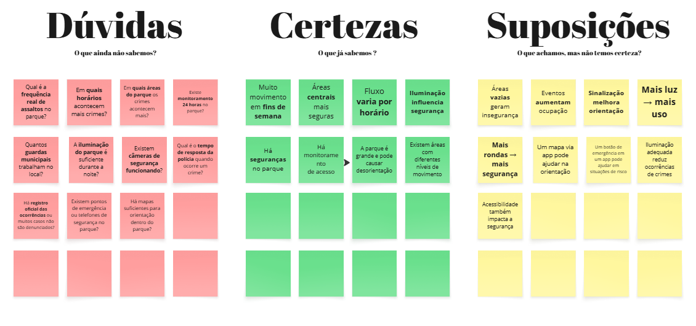
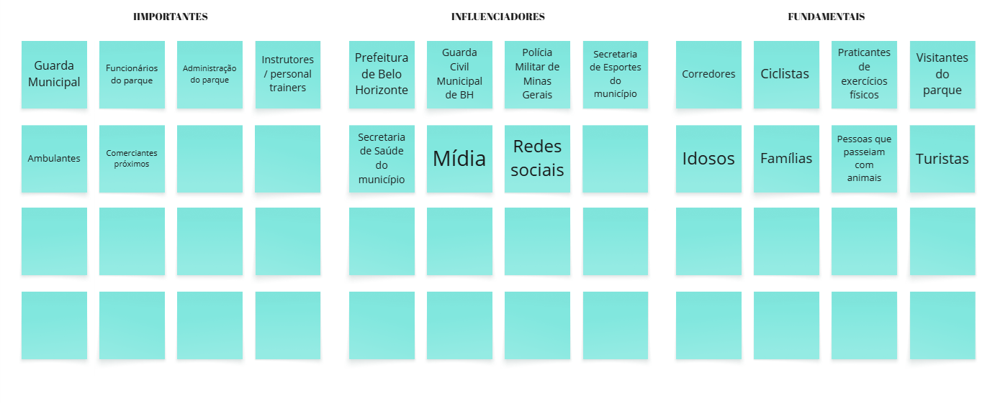
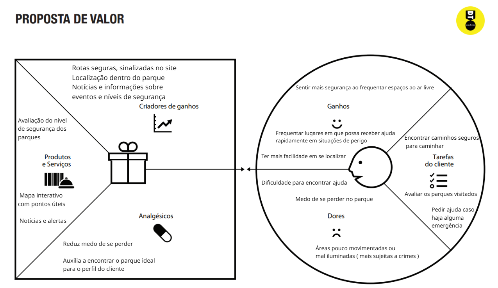

# COMO RODAR O PROJETO: 

Abra o terminal command prompt na pasta codigo ( cd codigo )
npm install
npm start
Abra o link http://localhost:3000 no navegador


# INTRODUÇÃO
Nosso objetivo é desenvolver uma aplicação web que permita aos usuários pesquisar parques, realizar avaliações, verificar informações e rotas mais seguras dentro desses espaços.

# Projeto: GREEN GUARD

## Repositório GitHub:
https://github.com/ICEI-PUC-Minas-PMGES-TI/pmg-es-2026-1-ti1-0438100-greenguard.git

## Alunos integrantes da equipe:

* Kaique Rodrigues do Vale
* Gabriel Rodrigues Lima
* Crystian Marcondes Oliveira Nascimento
* Guilherme Enzo Almeida Ferreira
* Yandi Orlando Santos Rivero
* Pedro Miguel Souza Dias

## Professores responsáveis

* Diego Augusto de Faria Barros
* Henrique Almeida Louzada
* Lucca Soares de Paiva Lacerda

# Contexto do projeto
## Problema:
Atualmente, é difícil encontrar informações organizadas sobre parques em um único lugar. Isso acaba dificultando a escolha do local para se realizar atividades e o planejamento delas. Além disso, a falta de dados atualizados sobre segurança, iluminação e ocorrências criminais nos parques de BH contribui para a sensação de insegurança de quem frequenta esses ambientes a fim de praticar atividades ao ar livre. Em Belo Horizonte, por exemplo, a percepção de segurança no período noturno é considerada baixa, e existem registros de furtos e vandalismo em parques públicos.

## Objetivo do projeto:
O objetivo é desenvolver uma aplicação web que facilite a busca e visualização de informações sobre os parques de BH, permitindo que o usuário encontre locais próximos dele, visualize dados relevantes como mapas dos parques, endereços, pontos de apoio e consulte avaliações de outros usuários feitas pelo site. Dessa forma, os praticantes de atividades ao ar livre poderão ter uma noção melhor do ambiente que pretendem visitar antes de visitá-lo, auxiliando na segurança deles.

## Justificativa:
A falta de acesso prático a mapeamento e informações claras sobre os parques pode causar insegurança nas pessoas que realizam atividades ao ar livre, principalmente em Belo Horizonte, que, como citado anteriormente, possui uma baixa percepção de segurança. Estudos mostram que fatores como iluminação, infraestrutura e histórico de ocorrências influenciam diretamente nessa percepção. Nesse contexto, o projeto se propõe a centralizar essas informações no contexto dos parques da cidade e torná-las mais acessíveis às pessoas que desejam se sentir mais seguras.

## Público-alvo:
### Importantes:
* Guarda Municipal 
* Funcionários do parque 
* Administração do parque 
* Instrutores e ou personal trainers 
* Ambulantes 
* Comerciantes próximos

### Influenciadores:
* Prefeitura de Belo Horizonte
* Guarda Civil Municipal de BH
* Polícia Militar de Minas Gerais
* Secretaria de Esportes do município 
* Secretaria de Saúde do município 
* Mídia 
* Redes Sociais.

### Fundamentais:
* Corredores; 
* Ciclistas; 
* Praticantes de exercícios físicos; 
* Visitantes do parque; 
* Idosos; 
* Famílias; 
* Pessoas que passeiam com animais; 
* Turistas.

# Processo de Product Discovery:
## Matriz CSD:

<p align="center">
  
</p>

## Mapa de stakeholders:

<p align="center">
  
</p>

## Entrevistas qualitativas:
Lúcia Santos Idosa ativa
67 anos · Aposentada · Caminhante frequente

Você costuma pesquisar informações sobre parques antes de visitá-los?
"Às vezes peço pra minha filha me ajudar no Google Maps, mas é complicado. Queria algo mais simples que me dissesse logo: esse parque é seguro, tem banheiro, tem banco pra sentar." 

Já deixou de ir a algum parque por não se sentir segura?
"Sim, várias vezes. Ouvi comentários de amigas no WhatsApp que tinha acontecido algo num parque e aí a gente desiste. Seria bom ter um lugar oficial pra ver isso."

O que te faria se sentir mais confiante para visitar um parque sozinha?
"Saber que tem iluminação boa e que outras pessoas estão indo também. Se eu pudesse ver no celular que outras idosas foram lá semana passada e se sentiram bem, já me animava."

Você teria dificuldade em usar um site ou aplicativo com mapa interativo?
"Depende. Se for simples como o WhatsApp, dá pra aprender. Mas se tiver muita coisa pra clicar, desisto logo."


Ana Moreira Mãe de criança
34 anos · Professora · Mãe do Lucas, 8 anos

Como você decide qual parque levar seu filho nos fins de semana?
"Geralmente vou onde já fui antes ou onde amigos indicaram. Não tenho como saber de antemão se o parque vai estar bem cuidado ou se vai ter gente estranha por lá."

Quais informações são mais importantes para você ao escolher um parque?
"Se tem brinquedos em bom estado, se o local é aberto e bem iluminado, se tem algum posto de segurança por perto. Também gosto de saber se tem banheiro limpo, que criança sempre precisa."

Você se preocupa com a segurança da criança dentro do parque?
"Sempre. Meu filho é agitado, sai correndo. Já me perdi dele por uns minutos e foi assustador. Um mapa do parque com pontos de apoio me ajudaria muito."

Você usaria um site que mostrasse avaliações de outros pais sobre o parque?
"Com certeza. Assim como olho avaliações de restaurante antes de ir, faria o mesmo pro parque. Principalmente se filtrasse por 'adequado para crianças'."


Rafael Carvalho Atleta recreativo
28 anos · Analista de TI · Corredor e ciclista

Com que frequência você pratica atividades físicas em parques de BH?
"Umas 4 vezes por semana. Corro no Parque das Mangabeiras e às vezes vou de bike pro Parque Ecológico da Pampulha. Mas dependo muito de dica de amigos pra saber onde ir."

Você já teve alguma experiência ruim de segurança em parque?
"Já. Fui correr de manhã cedo num parque que não conhecia bem e percebi que estava muito isolado. Fiquei desconfortável e voltei. Depois fiquei sabendo que tinha tido furto por lá."

O que você buscaria num site de parques como atleta?
"Informação sobre os percursos: extensão, nível de dificuldade, se é trilha ou asfalto. E também o movimento do parque por horário. Não adianta saber que o parque é bonito se está deserto às 6h da manhã."

Você contribuiria com avaliações ou relatos sobre os parques que frequenta?
"Sim, se fosse rápido. Tipo dar uma nota e escrever duas linhas. Igual ao Strava quando você termina uma atividade. Se demorar muito, a pessoa não faz."

## Highlights de pesquisa:
- Todos os entrevistados relataram dificuldade em encontrar informações organizadas e confiáveis sobre parques antes da visita.
- A percepção de segurança é o principal fator de decisão, especialmente para usuários que frequentam parques sozinhos ou com crianças.
- Avaliações de outros usuários são vistas como altamente relevantes — os entrevistados as comparam a avaliações de restaurantes e apps de corrida.
- Mapas simples com pontos de apoio (banheiros, postos de segurança, bancos) foram citados por dois dos três entrevistados como funcionalidade desejada.
- Usuários atletas demandam informações específicas como extensão de percurso, tipo de piso e nível de movimento por horário.
- A usabilidade é crítica: interfaces complexas afastam especialmente usuários mais velhos. Simplicidade é requisito, não diferencial.

## Personas:
**Persona 1: Dona Lúcia**  
**Idade**: 67 anos  
**Hobby**: Caminhadas ao ar livre em Parques
**Trabalho**: Aposentada

**Personalidade**: Tranquila e sociável, porém cuidadosa.

**Sonhos**: Se manter saudável e ativa sem preocupações.

**Objetos e Lugares**: Ela utiliza o celular, aplicativos como Google Maps para se orientar durante suas caminhadas no parque e grupos de Whatsapp para se informar de eventos ao ar Livre.  

**Objetivo Chave**: Seu principal objetivo é se sentir segura ao caminhar sozinha, conseguir se localizar facilmente dentro do parque e se informar sobre eventos de atividades físicas para idosos.

**Como devemos tratá-la**: Devemos tratá-la com simplicidade e clareza, oferecendo uma interface simples e fácil de navegar por, um mapa simples do parque que ela irá visitar, informações sobre possíveis eventos e alertas.
O comportamento que deixaria ela feliz seria o site funcionando rapidamente, mostrando rotas seguras de caminhada e permitindo que ela encontre as informações e novidades que precisa.

**Nunca devemos**: Nunca devemos complicar a interface ou usar linguagem difícil e esconder funções importantes (mapa, funções de ajuda). Ela não suporta e fica furiosa com apps lentos  ou confusos.


**Persona 2: Lucas Almeida**  
**Idade**: 8 anos  
**Hobby**: Brincar ao ar livre com sua família, andar de bicicleta, jogar bola e usar o celular para jogos
**Trabalho**: Estudante

**Personalidade**: É ativo, curioso e gosta de explorar o ambiente. Depende dos pais para se sentir seguro e não percebe riscos com facilidade.

**Sonhos**: Poder brincar livremente em diferentes parques. Se divertir sem preocupação e ter momentos felizes com sua família.

**Objetos e Lugares**: Frequenta o Parque Municipal Américo Renné Giannetti com a família. Brincar em meios às árvores, anda de bicicleta pelas trilhas e joga futebol. Vai ao parque principalmente nos fins de semana.

**Objetivo Chave**: Se divertir e brincar. Explorar o ambiente sem medo. Estar próximo dos pais ou responsáveis. Conhecer novos parques.

**Como devemos tratá-la**: Transmitir sensação de segurança a ele e seus responsáveis por meio de informações claras sobre parques adequados para crianças, rotas seguras e ambientes bem iluminados.

**Nunca devemos**: Deixar os responsáveis desinformados sobre áreas mal iluminadas, sem vigilância, áreas de risco ou parques que podem não ser o ambiente ideal para seu filho. 


**Persona 3: Rafael Carvalho**  
**Idade**: 28 anos  
**Hobby**: Corridas e Ciclismo
**Trabalho**: Analista de TI 

**Personalidade**: Independente, analítico e autodidata. Gosta de planejar seus treinos com antecedência.

**Sonhos**: Completar uma meia maratona e explorar todas as trilhas e parques de BH sem preocupações com segurança.

**Objetos e Lugares**: Usa Strava para registrar treinos, Google Maps para rotas e apps de previsão do tempo antes de sair. Frequenta o Parque das Mangabeiras, o Parque Ecológico da Pampulha e trilhas no entorno de BH. Depende de indicações de amigos e grupos de corrida para descobrir novos locais.

**Objetivo Chave**: Encontrar parques com percursos de corrida e ciclismo detalhados. Saber o movimento do parque por horário para evitar locais isolados. Verificar condições de segurança e ocorrências recentes. Compartilhar avaliações rápidas após atividades

**Como devemos tratá-la**: Com objetividade e dados. Oferecer informações técnicas dos percursos (distância, tipo de piso, elevação). Mostrar mapa interativo com rotas. Permitir avaliações rápidas pós-visita, como uma nota e comentário curto.

**Nunca devemos**: Apresentar informações vagas ou desatualizadas sobre segurança. Não ter dados sobre percursos ou movimentação do parque. Tornar o processo de avaliação demorado ou burocrático, isso faz com que ele desista se demorar.

**Persona 4: Ana Moreira**  
**Idade**: 34 anos  
**Hobby**: Passeios em família, culinária e leitura nos fins de semana
**Trabalho**: Professora

**Personalidade**: Protetora, organizada e bastante criteriosa nas decisões que envolvem o filho.

**Sonhos**: Criar o Lucas em ambientes seguros e saudáveis, com liberdade para explorar ao ar livre.

**Objetos e Lugares**: Usa smartphone diariamente para pesquisar sobre educação, saúde e lazer. Frequenta o Parque Municipal Américo Renné Giannetti e o Parque das Mangabeiras com a família. Utiliza grupos de WhatsApp de mães para trocar indicações e avisos sobre segurança.

**Objetivo Chave**: Encontrar parques seguros e adequados para crianças. Visualizar mapa do parque com pontos de apoio (banheiros, primeiros socorros). Ler avaliações de outros pais antes de visitar. Saber sobre eventos e atividades infantis nos parques.

**Como devemos tratá-la**: Com clareza e agilidade. Destacar informações de segurança e adequação para crianças logo na listagem dos parques. Permitir filtro "adequado para crianças". Exibir avaliações de outros pais de forma visível e organizada.

**Nunca devemos**:Omitir informações sobre áreas mal iluminadas ou sem vigilância. Esconder alertas de segurança ou dificultar o acesso ao mapa do parque. Exigir cadastro longo antes de mostrar informações básicas.

# Processo de Product Design:
## Histórias de usuários:
**Dona Lúcia**:
Eu como idosa que caminha sozinha no parque, quero visualizar minha localização em um mapa simples no celular, para conseguir me orientar facilmente e não me perder.

**Ana Moreira**:
Eu como Mãe de uma criança quero levar meu filho em ambientes seguros e em que eu possa monitorá-lo com facilidade e receber apoio se necessário. 

**Rafael Carvalho**:
Eu como atleta recreativo que corre e pedala frequentemente, quero visualizar informações sobre os percursos dos parques como distância e tipo de piso, para planejar melhor meus treinos.

## Proposta de Valor:

<p align="center">
  
</p>

## Requisitos do projeto:
**Requisitos funcionais**

O sistema deve exibir uma listagem de parques com foto, nome, nível de segurança, endereço e horário de funcionamento.	
O sistema deve permitir busca de parques por nome através de campo de texto.	
O sistema deve permitir filtrar parques por turno (dia/noite), tipo de atividade e distância.
O sistema deve exibir um mapa interativo com marcadores de todos os parques de Belo Horizonte, buscados dinamicamente via Overpass API.	
O sistema deve permitir que usuários criem posts de denúncia no fórum, informando descrição, categoria (Assalto, Reclamação, Segurança), parque e imagem.	
O sistema deve listar os posts do fórum com suporte a filtros por texto, categoria e intervalo de datas.	
O sistema deve permitir que usuários curtam posts do fórum, atualizando o contador de likes via API REST.	
O sistema deve permitir que usuários avaliem parques com comentário, classificação positiva/negativa e notas de 1 a 5 estrelas para segurança, iluminação e movimentação.	
O sistema deve exibir um feed de check-ins recentes de usuários nos parques, com fotos e botão de curtida.	
O sistema deve atribuir pontos (+10 pts) a cada check-in realizado pelo usuário, integrando o sistema de gamificação.	
O sistema deve exibir um ranking de usuários ordenado por pontuação (XP) acumulada.	
O sistema deve permitir que o usuário visualize e edite seus dados de perfil (nome, endereço, e-mail, foto).	

**Requisitos não funcionais**

A aplicação deve ser desenvolvida com HTML, CSS e JavaScript puros no frontend, sem uso de frameworks JavaScript.	
O backend deve ser baseado em Node.js com JSON Server, expondo uma API REST a partir do arquivo db.json.	
A aplicação deve ser responsiva, adaptando-se a telas de dispositivos móveis e desktops.	
O mapa deve carregar os parques de Belo Horizonte em tempo real via requisição à Overpass API, sem dados fixos no código.
As imagens enviadas no fórum devem ser armazenadas no servidor local e referenciadas por caminho relativo no banco de dados.	
O estado de curtidas do usuário deve ser persistido no localStorage do navegador para evitar curtidas duplicadas entre sessões.	
A interface deve utilizar as fontes Poppins e Montserrat e seguir a identidade visual do GreenGuard (paleta verde).	
A aplicação deve ser executada localmente via comando npm start, ficando acessível em http://localhost:3000.	


## Projeto de Interface:
### Wireframe:
 https://www.figma.com/design/CMkz5jHOl854m2UNuIhGdO/G4---Espa%C3%A7os-Seguros-para-Atividades-ao-Ar-Livre?node-id=0-1&t=voNOdiNS5YjjDp4r-1
### Fluxo de usuário com design das páginas finalizado e Protótipo interativo:
https://www.figma.com/design/CMkz5jHOl854m2UNuIhGdO/G4---Espa%C3%A7os-Seguros-para-Atividades-ao-Ar-Livre?node-id=53-2&t=Udf0tlWoGRWP1EuX-1 

# Metodologia:
## Ferramentas:
**Editor de código**: Visual Studio Code. 

Escolhido por ser leve, gratuito e ter suporte a diversas extensões que facilitam o desenvolvimento.

**Linguagens**: HTML, CSS e JavaScript. 

Escolhidas por serem a base do desenvolvimento web, permitindo criar a estrutura, o estilo e a interatividade da aplicação.

**Comunição**: WhatsApp. 

Usado pela praticidade e agilidade na comunicação entre os membros do grupo no dia a dia.

**Organização e planejamento**: Miro e WhatsApp.

O Miro foi escolhido por facilitar a criação de quadros, ajudando na organização de ideias e colaboração da equipe entre si.

**Prototipação**: Figma.

Utilizado por permitir a criação de wireframes/protótipos visuais de forma colaborativa, o que facilitará a validação das ideias entre os membros do grupo antes da implementação.

**Versionamento**: GitHub.

Usado para controle de versões do projeto, permitindo armazenar o código, acompanhar mudanças e trabalhar em equipe de forma organizada.

## Organização da equipe e divisão de papéis

A equipe se organizou usando ideias do Scrum, trabalhando de forma colaborativa e dividindo o projeto em pequenas etapas. Isso ajudou a desenvolver essa parte inicial do projeto aos poucos, permitindo ajustes conforme necessário ao longo do processo. Como ajustes nas personas, por exemplo.

Durante o desenvolvimento, realizamos o backlog das tarefas que precisavam ser feitas via WhatsApp e alinhamentos frequentes para acompanhar o andamento.

Todos os membros participaram juntos da criação das Personas, CSD, Mapa de Stakeholders e propostas de valor, contribuindo com ideias e melhorias.

Mesmo assim, cada integrante também assumiu alguma responsabilidade principal, novas responsabilidades serão atreladas aos membros quando o desenvolvimento começar de fato:

### Responsabilidades dos membros da Equipe
 
* Kaique Rodrigues do Vale - Documentação do Projeto 
* Gabriel Rodrigues Lima - Apresentação do projeto  
* Crystian Marcondes Oliveira Nascimento - Apresentação do projeto
* Guilherme Enzo Almeida Ferreira - Criação de slides para a apresentação  
* Yandi Orlando Santos Rivero - Estruturação do Código 
* Pedro Miguel Souza Dias - Apresentação do projeto

## Quadro de controle de tarefas (Kanban)


# Solução Implementada:
## Funcionalidades e Estrutura de Dados:

### (index.html / Cards.html) Listagem e busca de parques
Exibe cards de parques com foto, nome, nível de segurança em estrelas, endereço e horário de funcionamento. Conta com campo de busca textual e painel de filtros expansível por turno, atividade e distância.
Estrutura de dados associada
```
{
  "id": 1,
  "nome": "Parque Municipal de BH",
  "endereco": "Av. Afonso Pena, 1.377",
  "horario": "seg - sáb de 7:00 às 22:00",
  "seguranca": 4,
  "foto": "./assets/images/parque1.png"
}
```

Acesso: http://localhost:3000 → página inicial com cards de parques

### (Cards.html / kaique.html) Mapa interativo de parques
Mapa interativo centralizado em Belo Horizonte que busca dinamicamente todos os parques da cidade via Overpass API (OpenStreetMap) e exibe marcadores verdes para cada parque encontrado. Ao clicar no marcador, o nome do parque é exibido em popup.
API utilizada
POST https://overpass-api.de/api/interpreter
Query: node/way/relation["leisure"="park"] dentro de Belo Horizonte
Acesso
http://localhost:3000/Cards.html → seção central do mapa

### (forum.html + posts.js) Fórum de denúncias e ocorrências
Permite que usuários criem posts de denúncia categorizados (Assalto, Reclamação, Segurança), com descrição textual, seleção de parque e upload de imagem. Posts são carregados da API REST e exibidos com suporte a curtidas (likes), filtros por texto, data e categoria.
Estrutura de dados associada
```
{
  "id": 1,
  "autor_id": 2,
  "autor": "Pedro Miguel",
  "titulo": "Parque Ecológico da Pampulha",
  "categoria": "Assalto",
  "descricao": "Celular roubado próximo à entrada principal.",
  "data": "2026-04-22T14:30:00.000Z",
  "likes": 12,
  "imagem": "./assets/images/posts_sent/post_1714000000.jpg"
}
```
Acesso: http://localhost:3000/forum.html

### (Gabriel.html + gabriel.js) Sistema de avaliação e feedback
Formulário de feedback que permite ao usuário deixar um comentário sobre o parque, classificar o feedback como positivo ou negativo, e atribuir notas de 1 a 5 estrelas para segurança, iluminação e movimentação.
Estrutura de dados associada
```
{
  "comentario": "Parque bem iluminado e movimentado.",
  "feedback": "positivo",
  "classificacaoGeral": {
    "seguranca": 4,
    "iluminacao": 5,
    "movimentacao": 3
  }
}
```
Acesso: http://localhost:3000/Gabriel.html

### (rolagem_check-in.html + .js) Feed de check-ins com gamificação
Feed com scroll vertical exibindo check-ins recentes de usuários nos parques. Cada card mostra nome do parque, data, fotos e botão de curtida. Cada check-in exibe a pontuação de +10 pts conquistada, integrando o sistema de gamificação da plataforma.
Estrutura de dados associada
```
{
  "usuario": "CM",
  "parque": "Parque dos Mangabeiras",
  "data": "22/04/2026",
  "cidade": "Belo Horizonte",
  "fotos": ["parque3.png", "parque1.png", "parque2.png"],
  "likes": 123000,
  "pontos": 10
}
```
Acesso: http://localhost:3000/rolagem_check-in.html

### (forum.html + posts.js) Ranking de usuários
Sidebar lateral no fórum exibindo ranking de usuários ordenado por XP acumulado. Os dados são carregados da API REST e exibidos com posição, avatar, nome e pontuação de cada usuário.
Estrutura de dados associada
```
{
  "id": 1,
  "nome": "Junior Lopes",
  "foto_perfil": "./assets/images/user-imagem.png",
  "xp": 347
}
```
Acesso: http://localhost:3000/forum.html → sidebar direita

### (pedro.html) Página de perfil do usuário
Tela de perfil onde o usuário pode visualizar e editar seus dados pessoais (nome, usuário, endereço, e-mail, CPF) e redefinir senha. A foto de perfil é exibida em destaque no topo do card.
Acesso: http://localhost:3000/pedro.html

## Módulos e APIs:

### JSON Server 0.17.4
Backend REST simulado a partir do arquivo db.json. Serve as rotas /api/posts, /api/usuarios e /api/parques utilizadas pelo frontend.

### Express 4.17.1
Servidor Node.js que complementa o JSON Server, adicionando suporte a upload de imagens via rota POST /upload.

### Multer 1.4.5
Middleware para upload de arquivos. Salva imagens dos posts do fórum em public/assets/images/posts_sent/ com nome baseado em timestamp.

### Leaflet.js (unpkg CDN)
Biblioteca de mapas interativos. Usada para renderizar o mapa de BH com marcadores verdes para cada parque encontrado.

### Overpass API (OpenStreetMap)
API pública que retorna dados geográficos do OpenStreetMap. Usada para buscar dinamicamente todos os parques dentro dos limites de Belo Horizonte.

### Bootstrap 5.3.3 + Bootstrap Icons 1.11.3
Framework CSS e biblioteca de ícones. Usados para estilização de componentes do fórum e das páginas de listagem.

### Google Fonts (Poppins + Montserrat)
Fontes tipográficas utilizadas em toda a aplicação para padronização visual.

### localStorage (Web API)
Armazenamento local do navegador. Usado para persistir sessão do usuário logado e estado de curtidas nos posts do fórum.

## Referências Bibliográficas

* Numbeo – Índices de criminalidade em Belo Horizonte   
https://pt.numbeo.com/criminalidade/cidade/Belo-Horizonte  

* O Tempo: Dados sobre furtos em BH  
https://www.otempo.com.br/cidades/2025/5/23/bh-tem-ao-menos-8-furtos-por-hora-e-receptacao-e-obstaculo-para-combate-ao-crime  

* Pepsic: Estudo sobre percepção de segurança em espaços públicos
https://pepsic.bvsalud.org/scielo.php?pid=S1983-82202021000100011&script=sci_arttext  

* O Tempo: Parque municipal de BH
https://www.otempo.com.br/cidades/2024/9/27/parque-municipal-de-bh-ganha--botao-de-emergencia--para-pedido-d

* O Tempo: Furtos em parques públicos
https://www.otempo.com.br/super-noticia/crimes/2025/7/5/furtos-madrugada-assombram-parques-publicos-belo-horizonte

* https://repositorio.fjp.mg.gov.br/handle/mono/2388  

* https://estudosemdesign.emnuvens.com.br/design/article/view/777  
